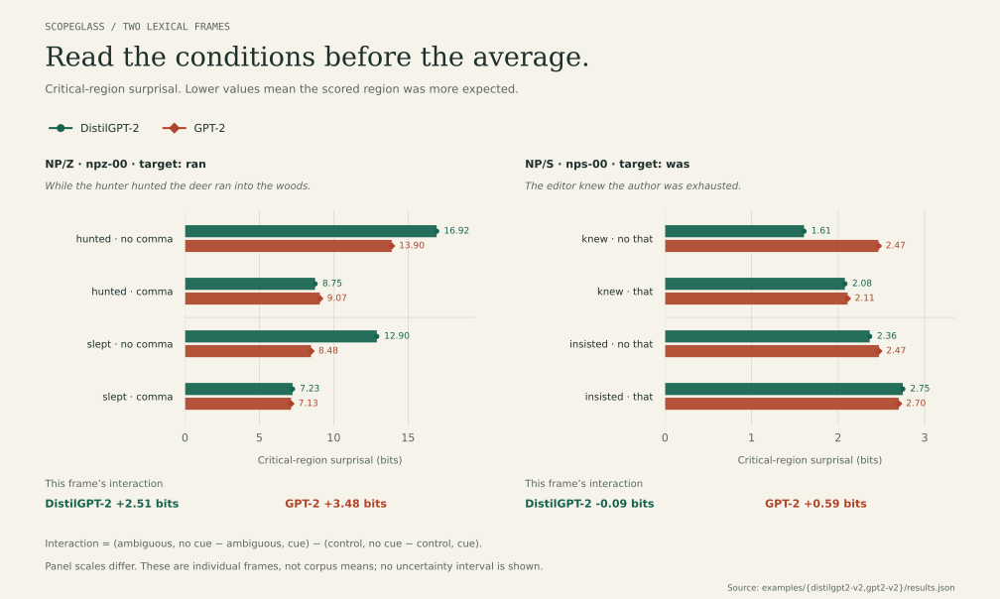
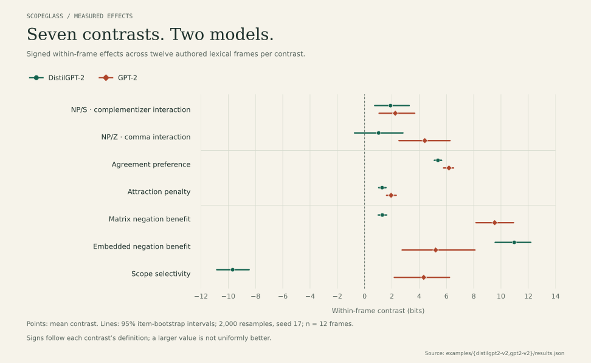
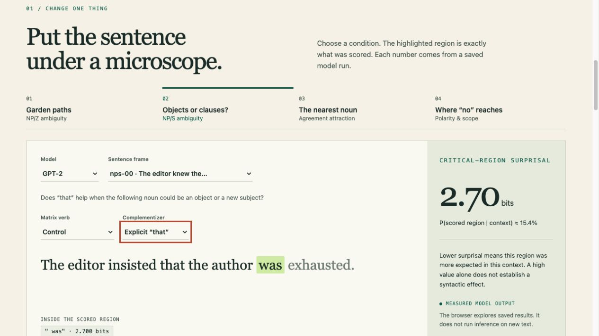

# Scopeglass

**A sentence can lead you down the wrong path. Does a language model feel the turn?**

> While the hunter hunted the deer **ran** into the woods.

Until *ran*, the deer could be what the hunter hunted. One word forces another
reading: the hunter hunted; the deer ran. Scopeglass measures what happens at
that turn, then changes the sentence just enough to test why it happened.

**4 experiments · 48 lexical frames · 288 conditions per model · 7 contrasts**

An interactive lab, a Python experiment runner, and a set of inspectable results
from **DistilGPT-2 and GPT-2**. Move a comma, add *that*, change the nearest noun,
or move a negation. See the critical word's surprisal, its token scores, all the
control conditions, and the variation hidden by an average.

## Four ways to catch a model off guard

### 1. The deer was never the object

```text
While the hunter hunted the deer   RAN into the woods.
While the hunter hunted, the deer  RAN into the woods.
While the hunter rested the deer   RAN into the woods.
While the hunter rested, the deer  RAN into the woods.
```

A comma announces the boundary. *Rested* supplies a control verb that doesn't
normally take an object. Does the comma help more after *hunted*? That interaction
is the **NP/Z garden-path contrast**; a raw comma benefit alone isn't enough.

### 2. Knowing a person, or knowing a fact?

```text
The editor knew the author          WAS exhausted.
The editor knew that the author     WAS exhausted.
The editor insisted the author      WAS exhausted.
The editor insisted that the author WAS exhausted.
```

*The author* initially fits as an object of *knew*. *Was* reveals an embedded
clause instead. Does *that* help more after the ambiguous verb than after the
clause-selecting control? This **NP/S contrast** asks a different structural
question from closing a subordinate clause. [Design and caveats →](docs/np-s.md)



These are individual frames, not hand-picked stand-ins for the mean. In the
editor frame above, DistilGPT-2's NP/S interaction is slightly negative even
though the aggregate is positive. The lab lets you inspect all twelve frames.

### 3. The closest noun is a distraction

> The key to the cabinet **is / are** on the table.  
> The key to the cabinets **is / are** on the table.

The subject remains singular. Does a plural distractor make *are* less surprising?
The full **agreement attraction** design also changes the subject's number,
separating overall agreement preference from susceptibility to a nearby noun.

### 4. “No” has an address

> **No** senator that the journalist interviewed has **ever / often** won an award.  
> The senator that **no** journalist interviewed has **ever / often** won an award.

Both contain negation. Only one puts it in the intended position to license
matrix *ever*. The **polarity and scope** experiment compares both locations to
no-negation baselines, with *often* as a lexical control. Structural position,
proximity, lexical preference, and alternative readings can pull apart here.

## Two models, some uncomfortable differences



| Contrast, in bits | DistilGPT-2 | GPT-2 |
| --- | ---: | ---: |
| NP/Z garden-path interaction | 1.03 | 4.41 |
| NP/S ambiguity interaction | 1.90 | 2.25 |
| Agreement preference | 5.38 | 6.18 |
| Agreement attraction | 1.28 | 1.94 |
| Matrix negation benefit | 1.30 | 9.54 |
| Embedded negation benefit | 10.97 | 5.21 |
| Scope selectivity: matrix − embedded benefit | −9.68 | 4.33 |

Each estimate averages a within-frame contrast over twelve frames. The plotted
95% intervals resample whole frames with replacement. They describe uncertainty
within this small authored set; they do not represent all English.

The scope result is especially worth taking apart. DistilGPT-2 gets a much larger
*ever*-specific benefit from embedded negation than from matrix negation. GPT-2
has a positive average scope contrast, yet its senator frame goes the other way.
That calls for examining the materials and competing readings, not declaring
one model a better grammarian.

[Two-model notes and exact revisions](docs/two-models.md) ·
[DistilGPT-2 data](examples/distilgpt2-v2/results.json) ·
[GPT-2 data](examples/gpt2-v2/results.json) ·
[Paired differences](examples/model-comparison.json)

## Play with the lab

[Open the hosted owner preview](https://scopeglass-lab.fam-lee200408.chatgpt.site)
— currently private; owner sign-in required. The local demo below is available
to everyone from the public repository.



The browser explores **saved, measured runs**. It doesn't score new text. Switch
models without losing your sentence or condition; inspect every control; compare
frame effects with the aggregate; move the surprisal slider to see what a bit
means in probability.

To run it locally after installing the package below:

```sh
python scripts/build_demo.py
python -m http.server 8000 --directory demo
```

Open `http://localhost:8000`. The full reports are standalone HTML files with
search, sorting, token details, pagination, CSV export, and printing:
[DistilGPT-2](examples/distilgpt2-v2/report.html) /
[GPT-2](examples/gpt2-v2/report.html). Download either HTML file and open it locally;
GitHub's source viewer doesn't execute it. [Report guide →](docs/report-guide.md) · [Demo guide →](docs/demo.md)

## Run an experiment

Python 3.11 or newer. The toy run needs no API key, server, or model download.

```sh
git clone https://github.com/eyezhick/scopeglass.git
cd scopeglass
python -m venv .venv
source .venv/bin/activate
pip install -e .
scopeglass run --out runs/toy
```

Open `runs/toy/report.html`. The toy scorer supplies stipulated values to check
the pipeline; its reports are labeled as toy output.

For measured scores:

```sh
pip install -e '.[models]'
scopeglass run --backend hf --model distilbert/distilgpt2 \
  --revision 2290a62682d06624634c1f46a6ad5be0f47f38aa \
  --out runs/distilgpt2

# Try a small, complete subset first.
scopeglass run --backend hf --model openai-community/gpt2 \
  --revision 607a30d783dfa663caf39e06633721c8d4cfcd7e \
  --experiment np_s --limit-items 3 --out runs/np-s
```

The first run downloads weights from Hugging Face. CPU is the default;
`--device mps` or `--device cuda` selects an available accelerator. Both checked-in
runs used CPU float32. Other causal models can use the adapter but haven't been
individually validated. Remote model code is disabled; weights must be available
as safetensors.

## Bring your own sentences

Export complete frames, edit their wording, and validate before spending time on
inference. CSV and JSONL preserve the same factorial structure.

```sh
scopeglass stimuli --experiment np_s --out materials.csv
scopeglass validate materials.csv
scopeglass run --materials materials.csv --out runs/custom-toy

# Inspect one frame, keeping all four of its conditions.
scopeglass stimuli --experiment np_s --item nps-00 --out editor.jsonl
```

[Materials format and validation](docs/custom-materials.md) explains required
fields, factor labels, and how to preserve the context/target boundary.

Compare matched runs and find influential frames:

```sh
scopeglass compare examples/distilgpt2-v2/results.json \
  examples/gpt2-v2/results.json --out runs/comparison.json
scopeglass diagnose examples/gpt2-v2/results.json --out runs/items.json
scopeglass report examples/gpt2-v2/results.json --out runs/rebuilt.html
```

Comparisons require identical materials, pair the same frames, and report
**right minus left**. They recompute contrasts from rows rather than trusting
cached summaries. Diagnostics include each frame's deviation and the mean after
leaving that frame out. [Comparison guide →](docs/comparisons.md)

## What exactly is being measured?

For target tokens t₁…tₙ after context c:

```text
S(target | c) = −Σ log₂ P(tᵢ | c, t₁…tᵢ₋₁)
```

The target is scored with its leading space. Context tokens and the displayed
spillover are excluded. Multi-token words are summed, never averaged. If the
tokenizer merges across the context/target boundary, the scorer refuses the item.

This is **lexical token surprisal**, not a direct distribution over parse trees.
The factorial contrasts test structural predictions without identifying the
model's internal parsing algorithm. No human reading times or acceptability
judgments have been collected for these materials.

Runs preserve the full materials, their SHA-256 hash, token IDs, resolved model
revision, package versions, device, and bootstrap seed. Missing conditions,
duplicate cells, inconsistent token sums, and non-finite scores are rejected.
The [methods](docs/methods.md) spell out equations, predicted signs, and confounds.
The [original run](docs/first-run.md) remains available for the earlier 240-condition suite.

## Development and figures

```sh
pip install -e '.[dev]'
ruff check src tests scripts
pytest -q
python -m build

pip install -e '.[plots]'
python scripts/render_figures.py
```

Figures are generated from checked-in measurements, as SVG and PNG. The demo
build and figure generation need no network or model inference. With `models`
installed, an additional offline test checks scoring against a tiny random
GPT-2 model's masked-label loss.

The package has no runtime dependencies until a model is requested. No paid
inference, telemetry, or hidden judging model.

## The next question

Hold syntax fixed and change whether the ambiguous noun is a plausible object.
If *hunted the deer* and *hunted the storm* produce different reanalysis effects,
how much comes from structure, and how much from event knowledge? That experiment
isn't implemented yet. Neither are PP attachment, multilingual materials, or
human reading-time comparisons. More independently reviewed lexical frames would
be a better next step than another impressive-looking aggregate.

## Reading behind the experiments

- [Hale (2001): A Probabilistic Earley Parser as a Psycholinguistic Model](https://aclanthology.org/N01-1021/).
- [Levy (2008): Expectation-based syntactic comprehension](https://escholarship.org/uc/item/66v7520b).
- [Marvin & Linzen (2018): Targeted Syntactic Evaluation of Language Models](https://arxiv.org/abs/1808.09031).
- [A Systematic Assessment of Syntactic Generalization in Neural Language Models (2020)](https://aclanthology.org/2020.acl-main.158/).
- [Syntactic Surprisal From Neural Models Predicts, But Underestimates, Human Processing Difficulty From Syntactic Ambiguities (2022)](https://aclanthology.org/2022.conll-1.20/).
- [Bylinina & Tikhonov (2022): Transformers in the loop: Polarity in neural models of language](https://aclanthology.org/2022.acl-long.455/).

Scopeglass is an independent implementation with newly authored materials. It
does not reproduce these papers' datasets or experiments exactly.

MIT licensed, including the original sentence materials. Model weights retain
their own licenses and are not distributed here.
